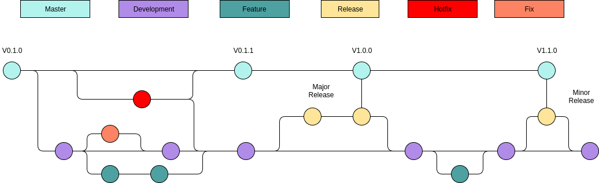

# Git

## Commit Flow


<br/><br/>
At nodeflux we have 2 branch default branch master and development. <br/>
Feature branch if we want to add new feature.<br/>
Release branch create when master already full tested. <br/>
Hotfix branch create when fixing bug on master (MINOR Version ex: 1.1.1 -> 1.1.2)

About Versioning:
https://semver.org/

## Feature Branch Management

### with JIRA

How To Create Feature Branch With Jira :

* Step 1 -> select create branch from jira
* Step 2 ->branch name naming convention follow the jira made <br/>
  (_Project Name_-_Title Name_ ex: SD-711-fr-show-page-without-cctv-streame)<br/>
  note: please choose branch from development
* Step 3 -> Terminal

> Access Feature Branch

```shell
git fetch --all
git checkout <branchname-createdfromjira>
```

## Commit Message Rule

#### Rule for commit message:

1. Please use git commit without -m
2. Separate Title from body with a blank line
3. Limit the subject line to 50 characters
4. Capitalize the subject line
5. Do not end the subject line with a period
6. Use the imperative mood in the subject line
7. Wrap the body at 72 characters
8. Use the body to explain what and why
   for detail: https://chris.beams.io/posts/git-commit/

#### commit message template
```shell

# <type>: (If applied, this commit will...) <subject> (Max 50 char)
# |<----  Using a Maximum Of 50 Characters  ---->|


# Explain why this change is being made
# |<----   Try To Limit Each Line to a Maximum Of 72 Characters   ---->|

# Provide links or keys to any relevant tickets, articles or other resources
# Example: Github issue #23

# --- COMMIT END ---
# Type can be
#    feature  (new feature)
#    fix      (bug fix)
#    refactor (refactoring production code)
#    style    (formatting, missing semi colons, etc; no code change)
#    docs     (changes to documentation)
#    test     (adding or refactoring tests; no production code change)
#    chore    (updating grunt tasks etc; no production code change)
# --------------------
# Remember to
#    Capitalize the subject line
#    Use the imperative mood in the subject line
#    Do not end the subject line with a period
#    Separate subject from body with a blank line
#    Use the body to explain what and why vs. how
#    Can use multiple lines with "-" for bullet points in body
# --------------------
# For more information about this template, check out
# https://gist.github.com/adeekshith/cd4c95a064977cdc6c50
```
To apply the template,

Save the above file to your local machine and use

git config --global commit.template <.git-commit-template.txt file path>

For example, if you saved it to your home folder, try:

git config --global commit.template ~/.git-commit-template.txt

## Pull Request Management

## Release Branch Management

## Rule Access Control

## Other Technique for git
#### for revert the commit but not at remote
```shell
$ git reset --soft HEAD~ # back to before commit
$ git reset HEAD . # back the before git add / before phase ready to commit
```
